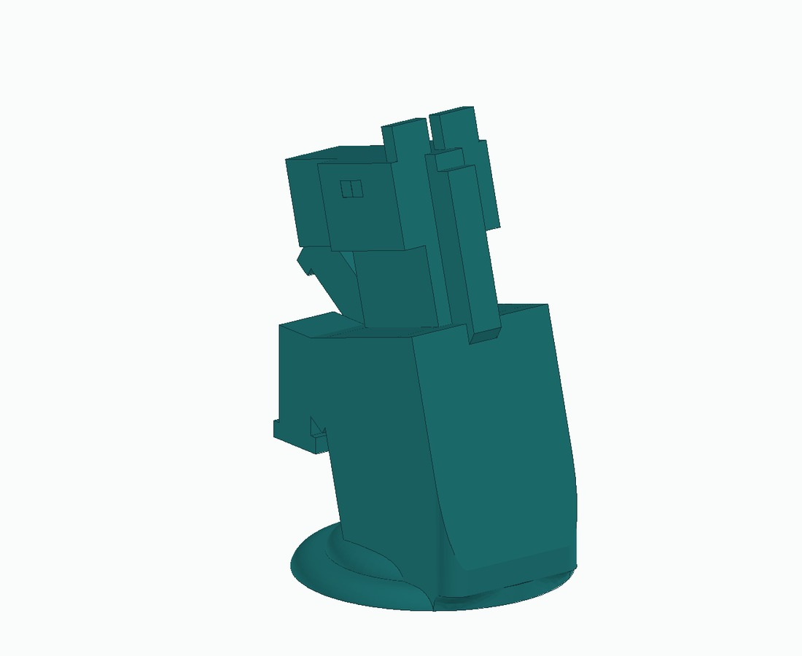
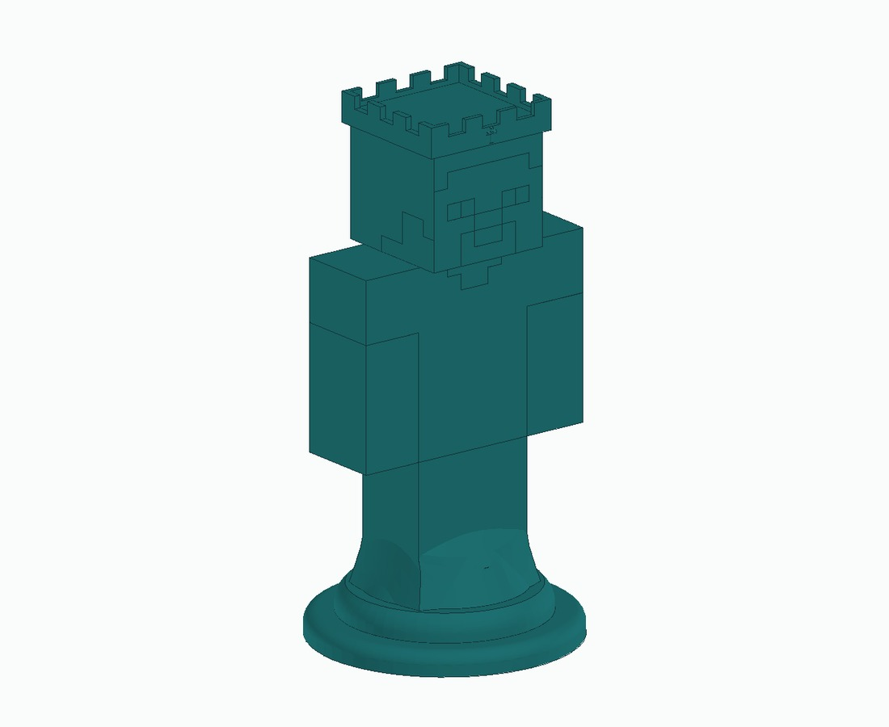
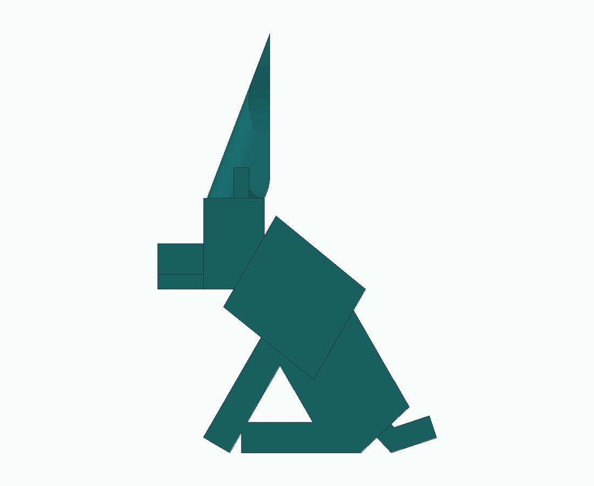

# Rigoberto Cortez
### Electrical Engineering · UC San Diego

About me: After working in agriculture for several summers, I've developed a fond appreciation for equipment and systems that stay dependable under difficult conditions. That perspective carries into my engineering projects, where I push designs to their limits, identify weaknesses, and find ways to make them more resilient. I'm particularly interested in applying this mindset to embedded systems, robotics, and electrical infrastructure.

[Portfolio slides](presentation/Rigoberto_Cortez_Portfolio.pptx) · [Portfolio PDF](presentation/Rigoberto_Cortez_Portfolio.pdf) · [GitHub](https://github.com/pur35t) · [Email](mailto:rcortezcadenas@ucsd.edu)

## Selected projects

| Project | Technical focus | Current status |
| --- | --- | --- |
| [Chess move tracking camera](projects/chess-camera.md) | Computer vision, board state, move inference | Working team project, described from SPIS experience |
| [Tracked line-following robot](projects/tracked-robot.md) | VEX, sensor integration, RobotC | Physical prototype, control software incomplete in the report |
| [Environment-adaptive speaker](projects/adaptive-speaker.md) | Enclosure CAD, sensing, audio architecture | Design proposal and partial enclosure CAD |
| [Minecraft chess set](projects/minecraft-chess.md) | Part modeling, engineering drawings, assembly | CAD models, drawings, and STL exports |
| [Star container and CAM studies](projects/container-cam.md) | Pocketing, contouring, machining setup | CAD and CAM simulation documentation |

## Project visuals

### My chess pieces

[Knight](projects/minecraft-chess.md#knight) | [Steve piece](projects/minecraft-chess.md#steve-piece) | [Wolf bishop](projects/minecraft-chess.md#wolf-bishop)
--- | --- | ---
 |  | 

### More project galleries

[Adaptive speaker](projects/adaptive-speaker.md) | [Star container and CAM](projects/container-cam.md) | [Bridge build](projects/bridge.md)
--- | --- | ---
 |  | 

## More work

[Bridge build and design reflection](projects/bridge.md) · [Chest cooler team CAD archive](projects/chest-cooler.md)

## Tools I’ve used

Python for the SPIS chess project. RobotC and VEX hardware through PLTW. Autodesk Inventor for CAD and CAM coursework. Engineering drawings, fabrication planning, and hands-on assembly.

I’m developing my C and embedded programming skills and looking for opportunities to contribute to robotics or hardware teams.

## How to explore this portfolio

Each project page describes the goal, design decisions, available results, and what I would improve. Native CAD files are in [`assets/cad`](assets/cad), with original filenames mapped in [the source index](docs/sources.md). The presentation offers a visual overview with embedded images. For a standalone view of the portfolio, open the PDF above.

Team projects include shared work. Individual credit is specified where the source documents identify it. Proposed features and completed work are labeled separately.

---

San Diego, California · Updated October 2026
