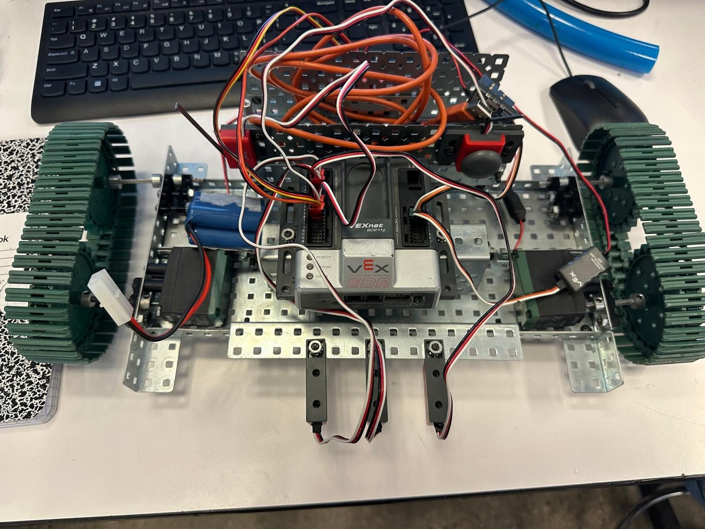

# Rigoberto Cortez
### Electrical Engineering · UC San Diego

I’m a first-year electrical engineering student interested in embedded systems, computer vision, and control. I like building things that connect software to the physical world, then finding out where the design breaks.

[Portfolio slides](presentation/Rigoberto_Cortez_Portfolio.pptx) · [Portfolio PDF](presentation/Rigoberto_Cortez_Portfolio.pdf) · [GitHub](https://github.com/pur35t) · [Email](mailto:rcortezcadenas@ucsd.edu)

## Selected projects

| Project | Technical focus | Current status |
| --- | --- | --- |
| [Chess move tracking camera](projects/chess-camera.md) | Computer vision, board state, move inference | Working team project, described from SPIS experience |
| [Tracked line-following robot](projects/tracked-robot.md) | VEX, sensor integration, RobotC | Physical prototype, control software incomplete in the report |
| [Environment-adaptive speaker](projects/adaptive-speaker.md) | Enclosure CAD, sensing, audio architecture | Design proposal and partial enclosure CAD |
| [Minecraft chess set](projects/minecraft-chess.md) | Part modeling, engineering drawings, assembly | CAD models, drawings, and STL exports |
| [Star container and CAM studies](projects/container-cam.md) | Pocketing, contouring, machining setup | CAD and CAM simulation documentation |
| [Insole design study](projects/insole-study.md) | Material selection, prototyping, sensing exploration | Planning and design study |

## More work

[Bridge build and design reflection](projects/bridge.md) · [Chest cooler team CAD archive](projects/chest-cooler.md)

## Tools I’ve used

Python for the SPIS chess project. RobotC and VEX hardware through PLTW. Autodesk Inventor for CAD and CAM coursework. Engineering drawings, fabrication planning, and hands-on assembly.

I’m developing my C and embedded programming skills and looking for opportunities to contribute to robotics or hardware teams.

## How to explore this portfolio

Each project page describes the goal, design decisions, available results, and what I would improve. Native CAD files are in [`assets/cad`](assets/cad), with original filenames mapped in [the source index](docs/sources.md). The presentation offers a shorter visual overview.

Team projects include shared work. Individual credit is specified where the source documents identify it. Proposed features and completed work are labeled separately.

---

San Diego, California · Updated October 2026
