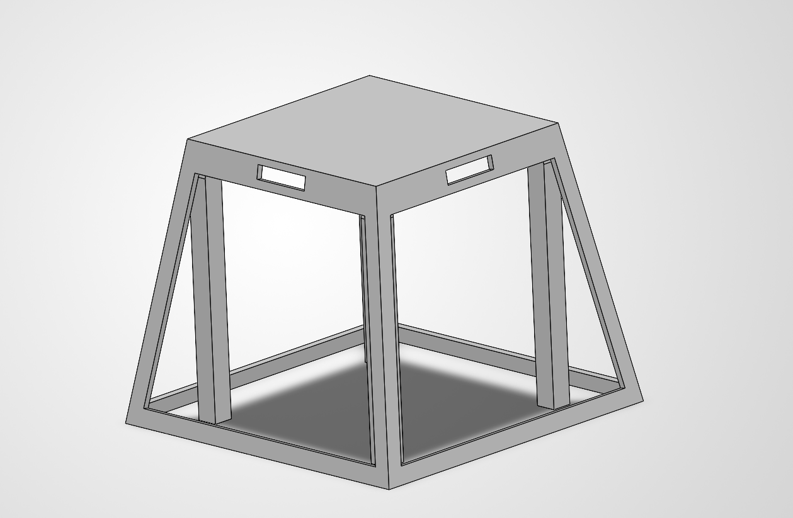
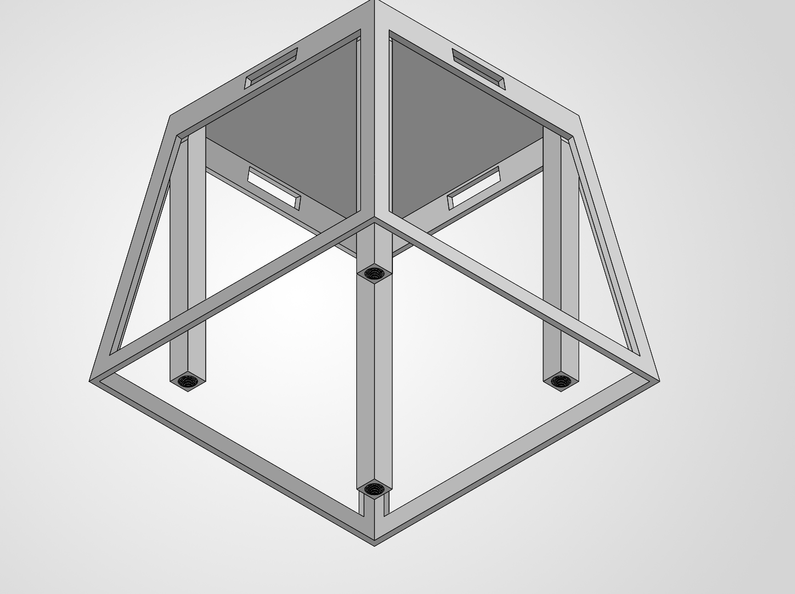
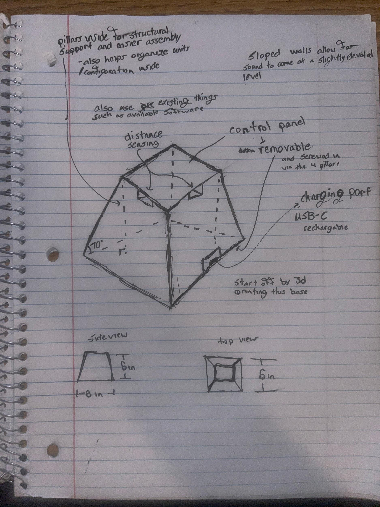

# Environment-adaptive Bluetooth speaker

**ECE Makerspace application design project · 2026 · Individual concept**

## Goal

Design a portable speaker that can reduce output toward a nearby obstruction while continuing to play in other directions. The proposed system combines a four-sided enclosure with distance sensing and independent audio control.

## Completed design work

I modeled a truncated square-pyramid enclosure frame with four internal structural posts and bottom fastener locations. The concept uses an approximately **6 × 6-inch base, 4 × 4-inch top, and 4.5-inch height**. The wide base provides room for heavier components, and the flat top provides a control surface.

The CAD images show the frame and service-access concept. Driver openings, electronics mounts, and a completed physical speaker remain future work.

## Proposed architecture

- Four small full-range drivers, one on each angled face.
- Four time-of-flight sensors aligned with the output directions.
- An ESP32 reading the sensors and requesting per-face audio adjustments.
- Bluetooth audio, rechargeable power, and USB-C charging.
- A control that lets the user disable the adaptive mode.

The first software version would classify each face as open or obstructed using an experimentally chosen distance threshold. Later versions could adjust output gradually.

## Important unresolved decision

The proposal names a **2.0-channel Bluetooth amplifier**, but the adaptive behavior calls for **four independently controllable driver outputs**. That module alone does not establish the required control architecture. The next design step is to select suitable amplification and per-channel gain or mute control before finalizing the electronics.

## Fabrication plan

Use woodworking or CNC equipment for enclosure panels and driver openings. Produce small sensor or board mounts with 3D printing. Keep the bottom accessible for assembly and servicing, and secure wiring to reduce rattling.

## Validation plan

First verify normal audio operation. Then compare adaptive mode on and off at several wall and corner placements. Measure electrical power and audible effects, and check sensor thresholds, rattling, and clearance.

Reduced power consumption and improved acoustics are **design hypotheses**. The supplied materials contain no physical prototype or measurements demonstrating those benefits. Shared enclosure volume and driver interaction also need investigation.

[Read the complete design proposal](../assets/documents/speaker-design-proposal.pdf)

## Visual gallery

### Original design sketch

Speaker concept notebook sketch
---

Select any image to open it at full size.

[Back to portfolio](../README.md)
