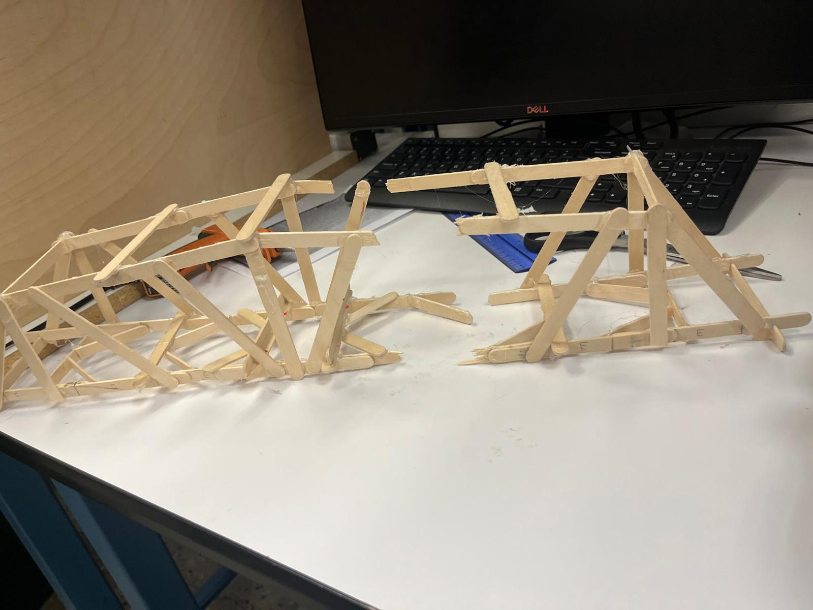
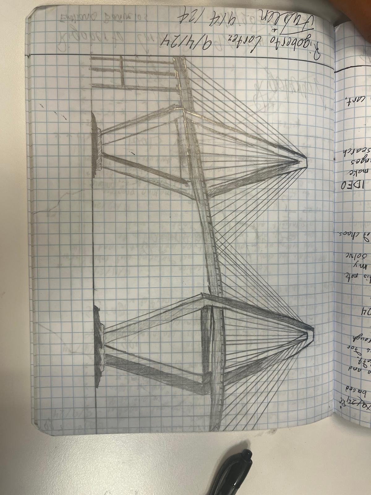

# Bridge build and design reflection

**PLTW Computer Integrated Manufacturing · December 2024 · Individual build**

## Goal and constraints

Build a bridge from no more than **60 popsicle sticks** that spans a **24-inch gap** and supports a hanging load. The project allowed roughly two to three weeks for research and construction.

## Build

I researched truss patterns and used triangular bracing to distribute load. The report includes notebook sketches and construction photographs. Glue choice and joint placement affected stiffness and alignment during assembly.

## Outcome

The bridge carried a load, but I did not preserve a measured maximum in the report. It also fell approximately **four inches short** of the required span. This was a requirements failure that a dimensional check early in the build could have caught.

## What I learned

Verify the base geometry before adding reinforcement. More bracing cannot recover a missing span requirement. I would lay out the full structure at scale, check the gap and load attachment, and then build and test the joints.

This bridge is separate from the balsa tower mentioned in other project descriptions. No tower load result is attributed to this build.

[Back to portfolio](../README.md)
