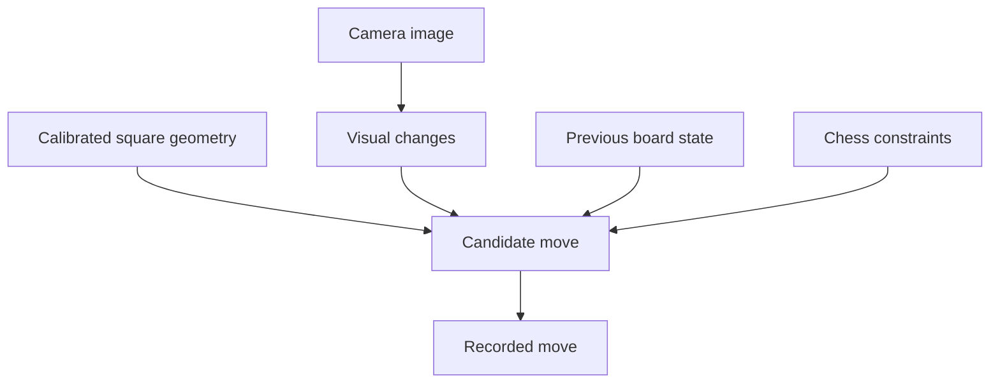

# Chess move tracking camera

**UC San Diego SPIS · Summer 2026 · Team project**

A camera system that records moves on a physical chessboard. This was my first computer vision project during the five-week SPIS program.

## Goal

Infer chess moves from a camera view while tolerating the small disturbances that happen during normal play. Piece placement, shadows, and camera motion can make a change in the image ambiguous.

## Approach

The project used calibrated board-square geometry to associate image locations with chess squares. It combined visual changes with the previous board state and chess constraints to narrow the possible move interpretations.

The key idea was to use information the system already knew about the game. A visual change became a candidate state transition that could be checked against the current position.

## System overview

The following diagram summarizes the approach described above.

## Testing and iteration

We deliberately introduced shadows, bumped pieces, shook the camera, and used imperfect piece placement. I reported one incorrect move in a trial and approximately 98% move accuracy in our informal testing. The trial size and protocol are not preserved in the supplied files, so this is a project observation rather than a reproducible benchmark.

The early version struggled to identify moves. We spent roughly two days adjusting the balance between sensitivity and noise before it became useful. Seeing correct moves appear consistently taught me the value of testing the full pipeline on real inputs.

## My contribution

I worked with the team on building, testing, and tuning the system. I explored the relationship between calibrated board geometry, image changes, and the prior game state. This page does not assign sole ownership of the team’s code.

## What I learned

- Domain constraints can simplify a perception problem.
- Calibration and state representation matter as much as the detection step.
- Deliberate disturbances expose weaknesses that a clean demonstration can hide.

## Next iteration

Preserve a labeled test sequence, report the number of moves and error types, and test camera shifts separately from lighting changes. Package the calibration procedure and code so another person can reproduce the result.

**Available evidence:** [team source code](https://github.com/apmartinez2008-bot/SPIS_final), [project demonstration video](https://www.youtube.com/watch?v=CqR65Nzltz0), and my SPIS testing account. Evaluation logs and extracted video frames are not included in this repository.

[Back to portfolio](../README.md)
