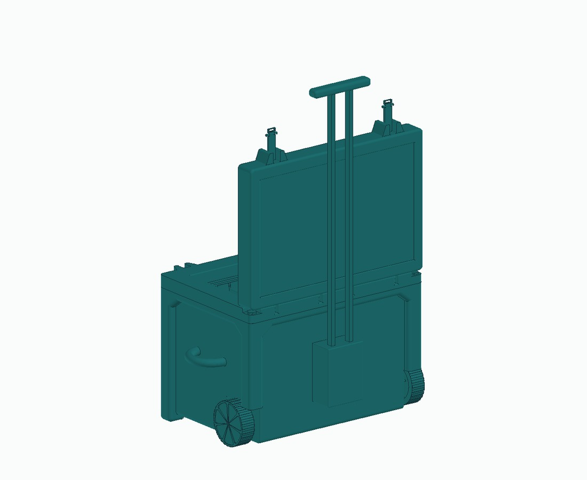
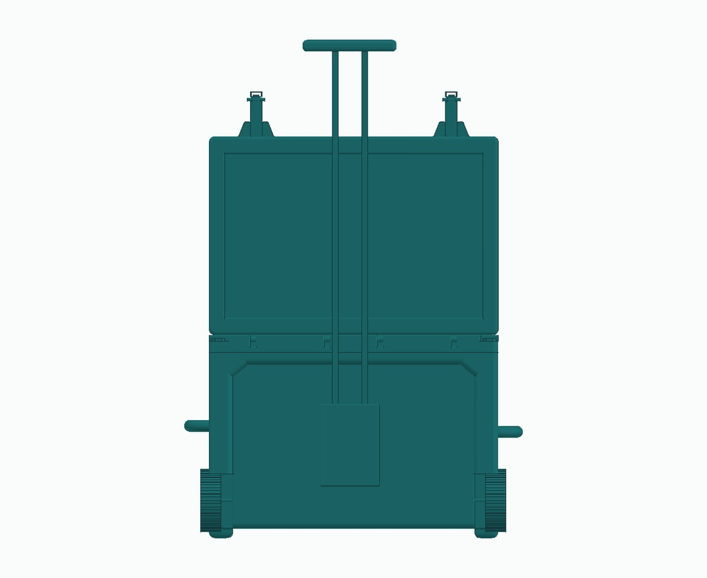

# Chest cooler team CAD archive

**PLTW team design archive · CAD evidence**

The supplied Chest Cool Assembly archive contains several cooler STEP revisions, a lid, an assembly, a sandwich model and drawing, and NC files. It also contains star-container files documented on the [container and CAM page](container-cam.md).

## Available work

The multiple cooler variants and assembly preserve a team CAD workflow. The archive provides geometry that can be opened in a compatible CAD tool.

[Download the team cooler assembly STEP](../assets/cad/cooler-team-assembly.step)

## Attribution and status

The cooler assembly is stored in the archive’s `emili folder`. The `rigo folder` is empty. The supplied filenames alone do not identify my specific cooler geometry or establish my role in machining it, so this page presents the assembly as team context.

The NC files are retained only in the original upload. They have not been validated for a machine, stock, or controller and are not included as runnable portfolio examples.

**Next documentation step:** identify my contribution and add a physical build photograph before making this a featured project.

## Visual gallery

### Team assembly views

Assembly isometric view | Assembly end view
--- | ---
 | 

Select any image to open it at full size.

[Back to portfolio](../README.md)
