# Star container and CAM studies

**PLTW Computer Integrated Manufacturing · Spring 2025 · CAD and simulation**

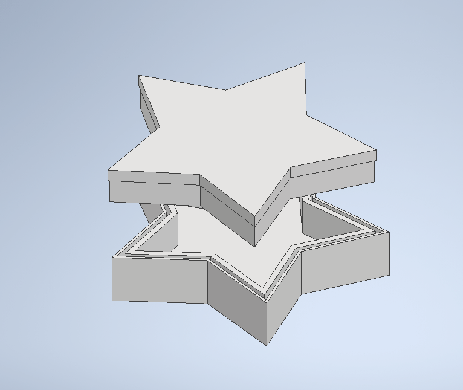

## Goal

Model a fitted container and prepare machining operations that reflect the part geometry. The star-shaped base and lid provided an opportunity to consider wall thickness, fit, and internal pocketing.

## Documented work

The container worksheet, dated April 22, 2025, includes model views, dimensions, freehand sketches, and CAM operation trees. It specifies **2D pocket** and **2D contour** strategies for the base and lid.

Related exercises document facing, changing the part origin, multiple pockets, island roughing, slotting, drilling, and machining simple and complex surfaces.

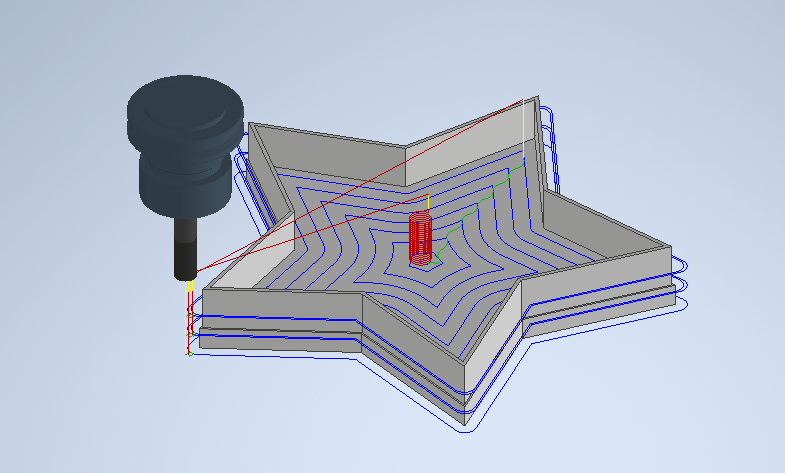

## Design decisions

The sketches discuss the lid fitting within the container opening. The work also considers how small or deep features affect the tool’s ability to reach the geometry.

My written reflections focus on reducing unnecessary tool travel and thinking about manufacturability during CAD design. They do not report a measured machining-time improvement.

## Outcome

The supplied evidence supports CAD modeling, CAM setup, and simulation. It does not include a photograph of a finished machined container or a verified machine run.

The star container STEP files appear in the Chest Cool Assembly archive. They match the container theme, but their author metadata is not established independently by the filenames.

## Files

[Container base STEP](../assets/cad/container-base.step) · [Container lid STEP](../assets/cad/container-lid.step)

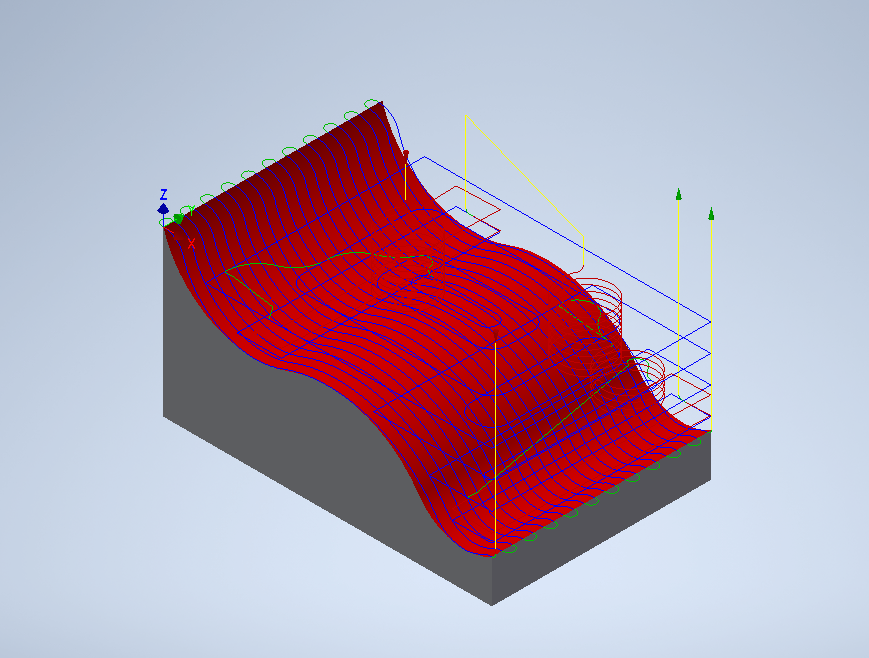

## Next iteration

Specify fit tolerances and stock dimensions with explicit units, review tool clearance, and make a physical prototype. Compare actual fit and finish against the CAD model.

## Visual gallery

### Base and lid geometry

Base CAD view | Lid CAD view
--- | ---
[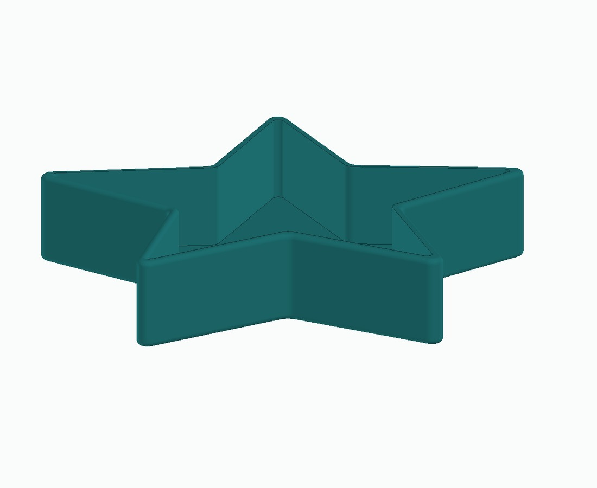](../assets/images/container-base-iso.jpg) | [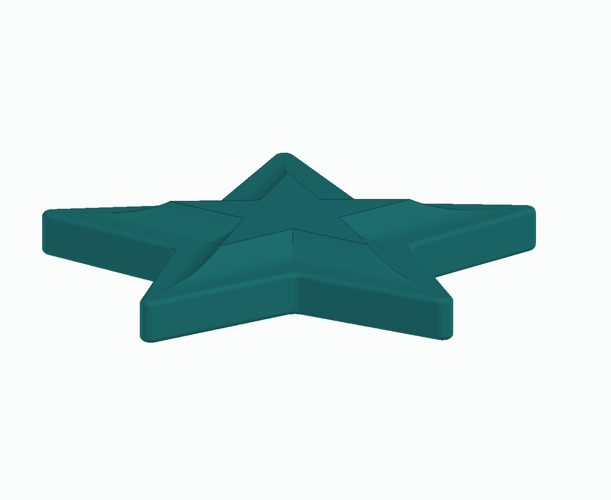](../assets/images/container-lid-iso.jpg)

Base end view | Lid end view
--- | ---
 | [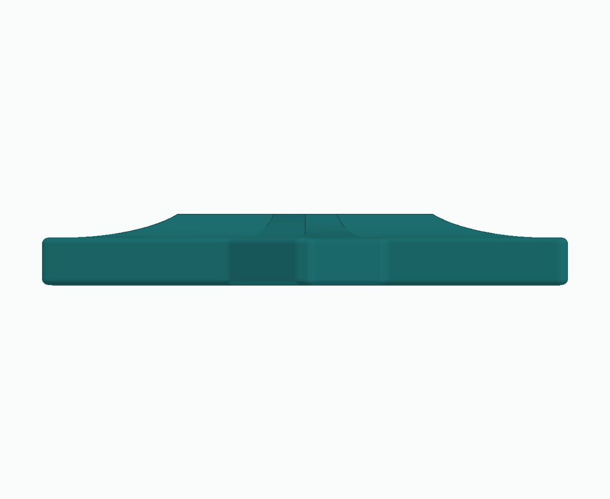](../assets/images/container-lid-front.jpg)

Original base CAD screenshot | Original lid CAD screenshot
--- | ---
[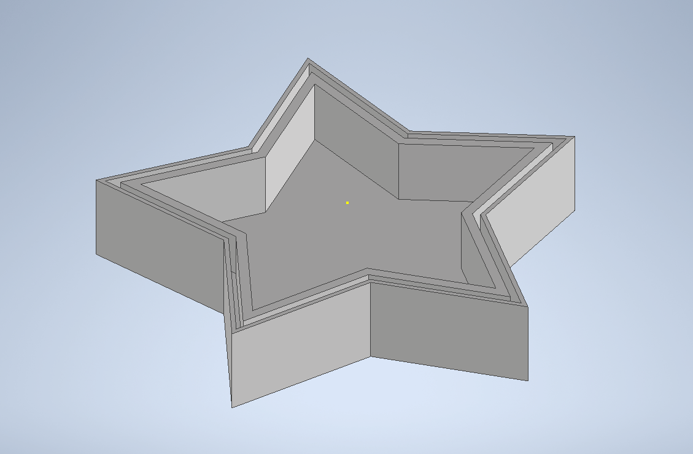](../assets/images/container-base.png) | [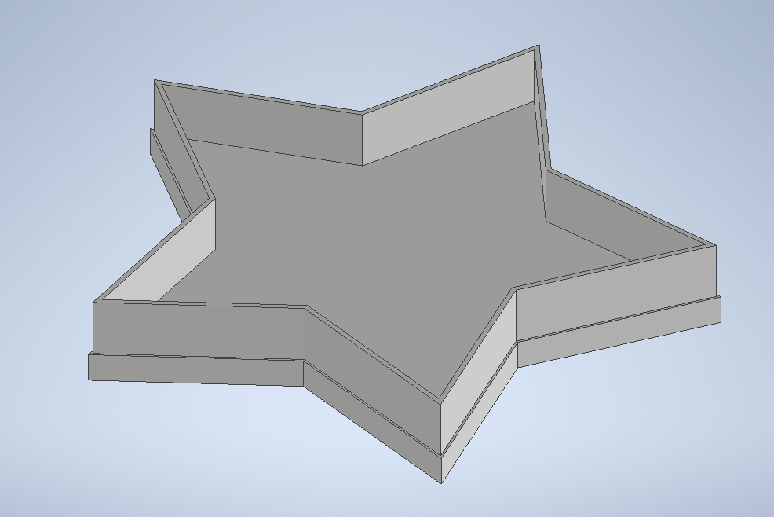](../assets/images/container-lid.png)

### Dimensions and fit

Dimensioned top view | Dimensioned side view | Fit sketch
--- | --- | ---
[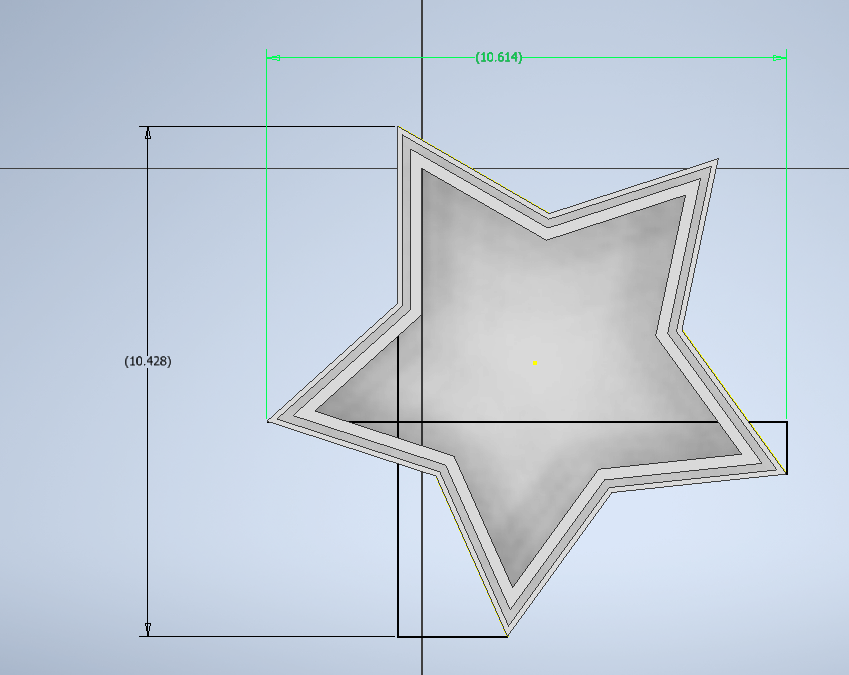](../assets/images/container-dimensions.png) | [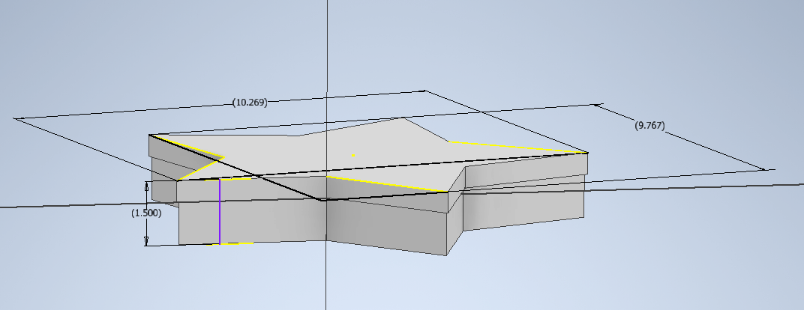](../assets/images/container-side-dimensions.png) | [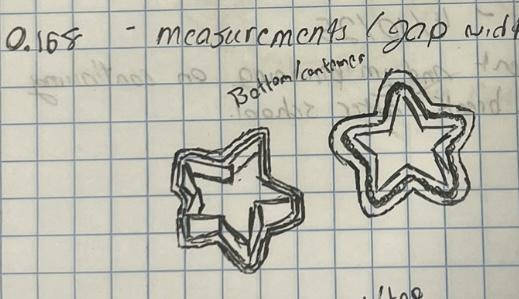](../assets/images/container-fit-sketch.jpg)

### Design sketches

Initial container sketch
---
[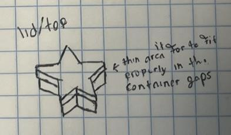](../assets/images/container-sketch.jpg)

### Toolpath planning

Lid toolpath | Drilling exercise | Pocket simulation
--- | --- | ---
[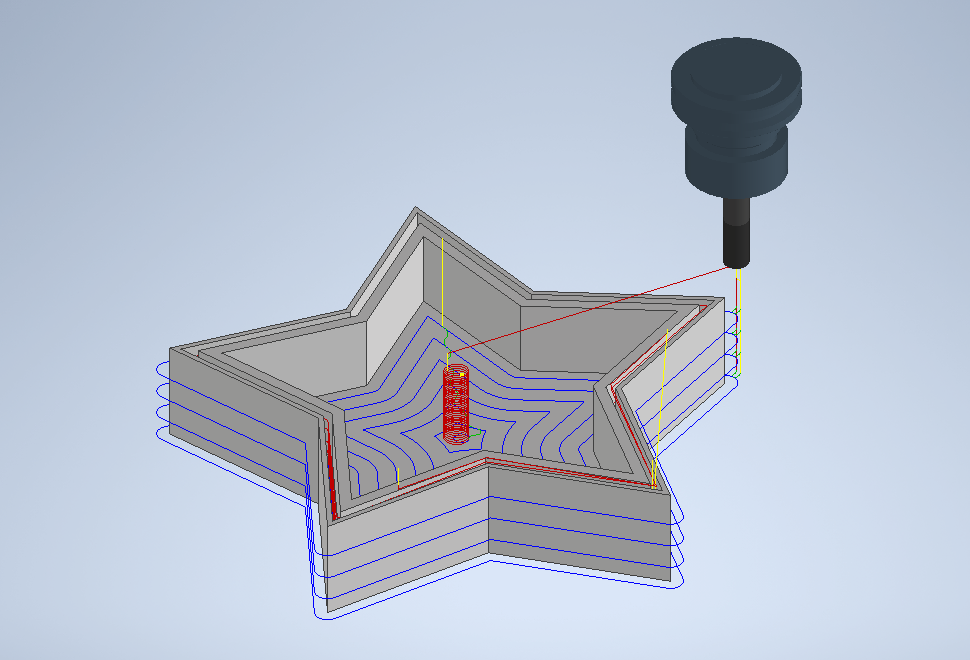](../assets/images/container-lid-toolpath.png) | [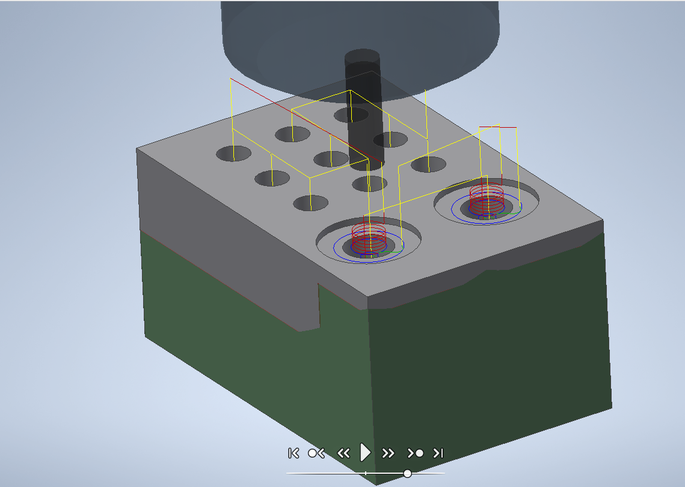](../assets/images/cam-drilling.png) | [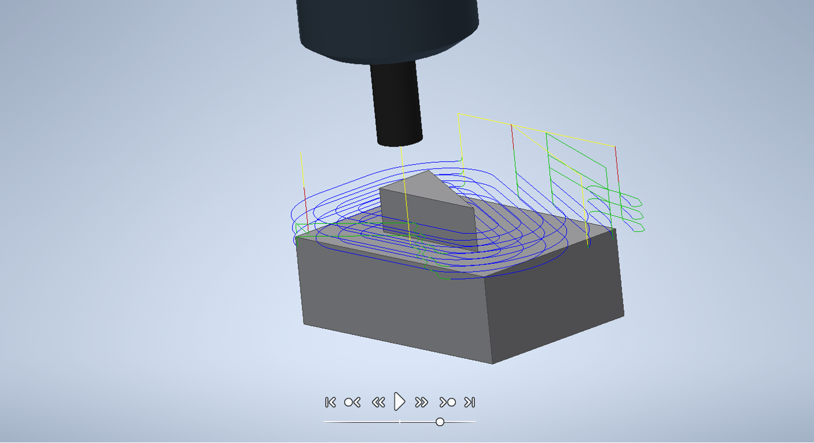](../assets/images/cam-pocket-simulation.png)

### Surface machining

Complex surface toolpath
---
[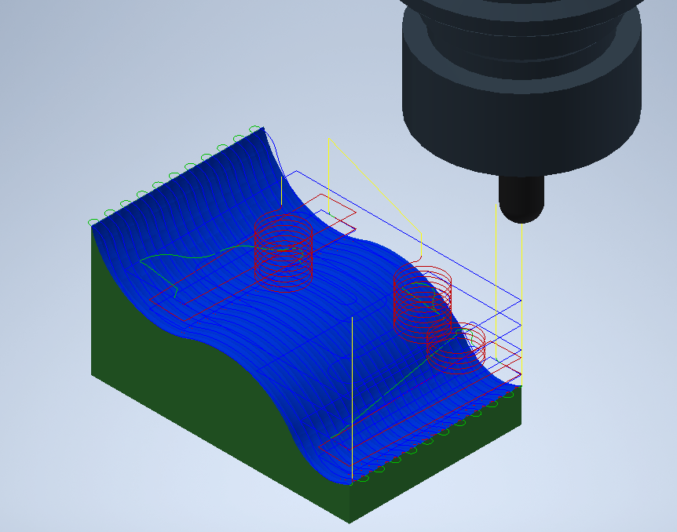](../assets/images/cam-complex-surface.png)

Select any image to open it at full size.

[Back to portfolio](../README.md)
