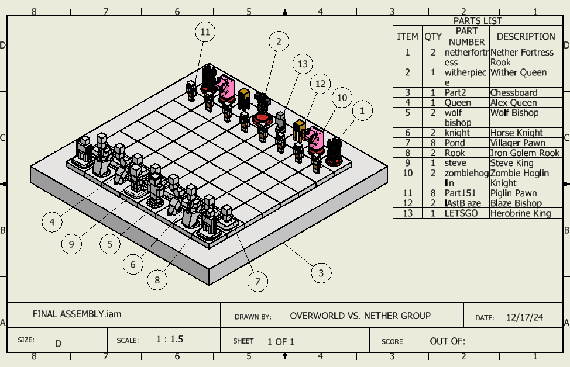
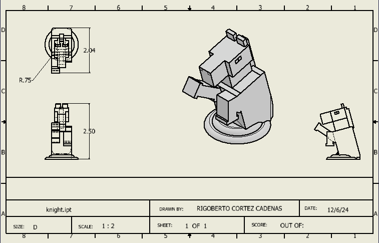

# Minecraft chess set

**PLTW CAD project · November–December 2024 · Team assembly**

## Goal

Translate Minecraft-inspired characters into chess pieces, then organize the parts into a complete assembly with engineering drawings and exportable geometry.

## My documented work

Drawing title blocks identify me as the designer of the **knight, Steve piece, and wolf bishop**. The engineering archive also contains STEP geometry for those parts.

The files demonstrate part modeling, dimensioned views, and integration into a shared chess set. STL exports exist in the group archive, but the supplied materials do not establish that the complete set was physically printed.

## Design considerations

The pieces combine recognizable character geometry with a chess-piece base. Dimensioned views describe the geometry more clearly than a single rendered view, and neutral STEP exports allow the models to move between CAD tools.

## Team credit

The full assembly is shared team work. Drawing title blocks also identify **Natalie Munoz, Stephanie Garcia Solis, and Emiliano Banuelos** on other pieces. I claim the three pieces credited to me, rather than authorship of the entire set.

## Native CAD files

- [Knight STEP](../assets/cad/chess-knight.step)
- [Steve piece STEP](../assets/cad/chess-steve.step)
- [Wolf bishop STEP](../assets/cad/chess-wolf-bishop.step)

## Next iteration

Check base dimensions and consistency across the set, review small features for manufacturability, and build a physical test print. Record fit, stability, and any changes between the model and final part.

[Back to portfolio](../README.md)
