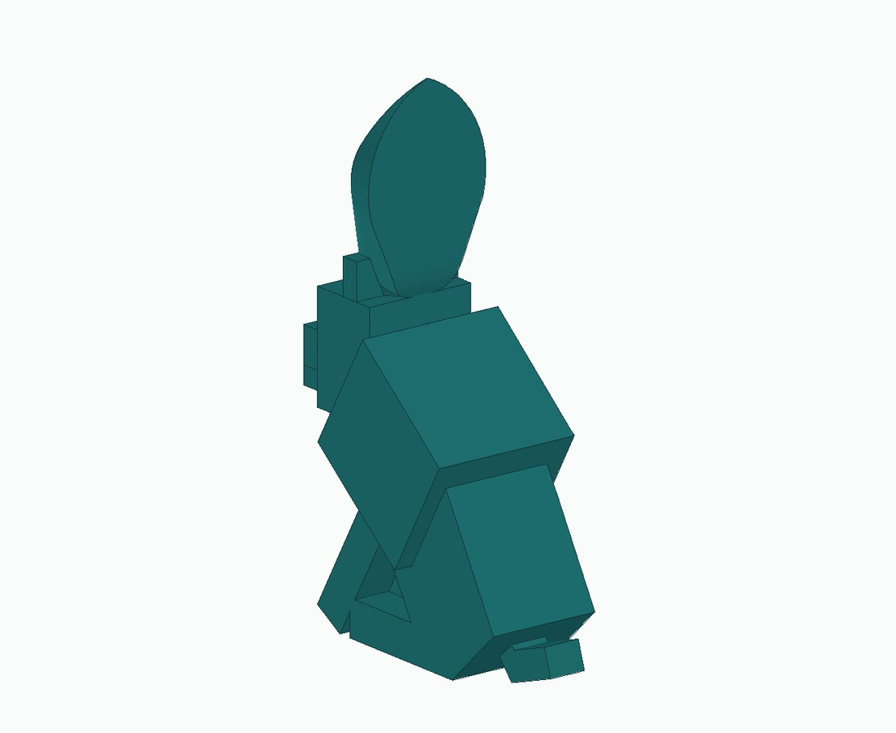
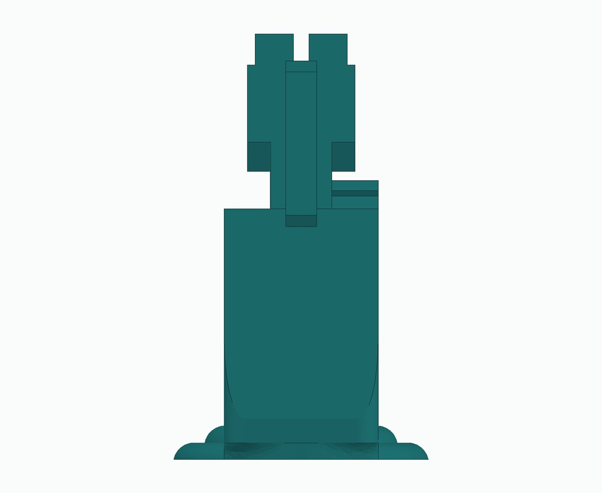
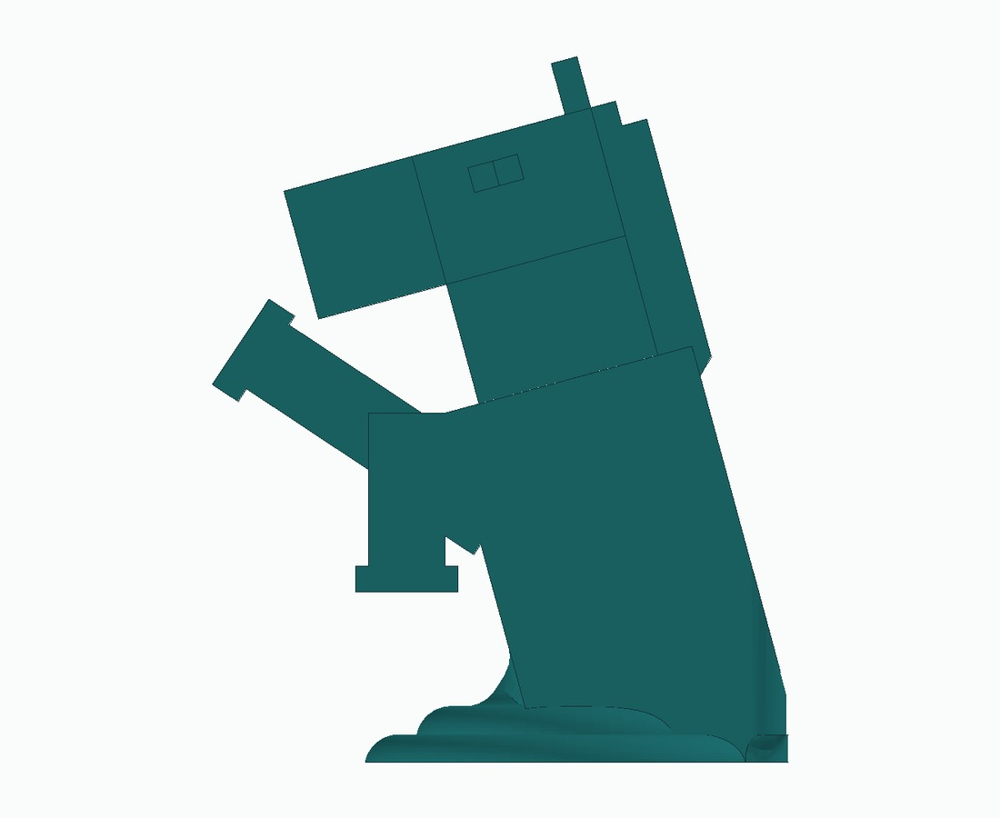
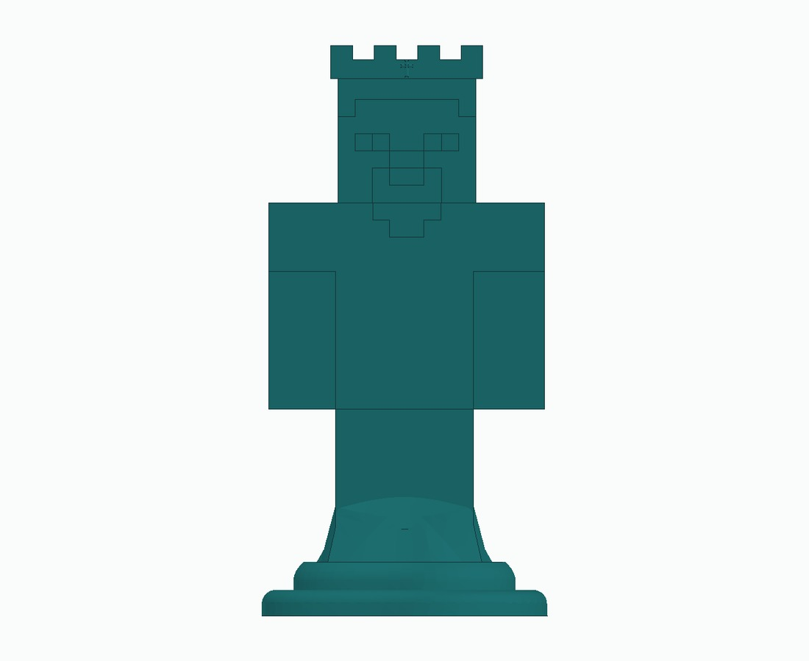
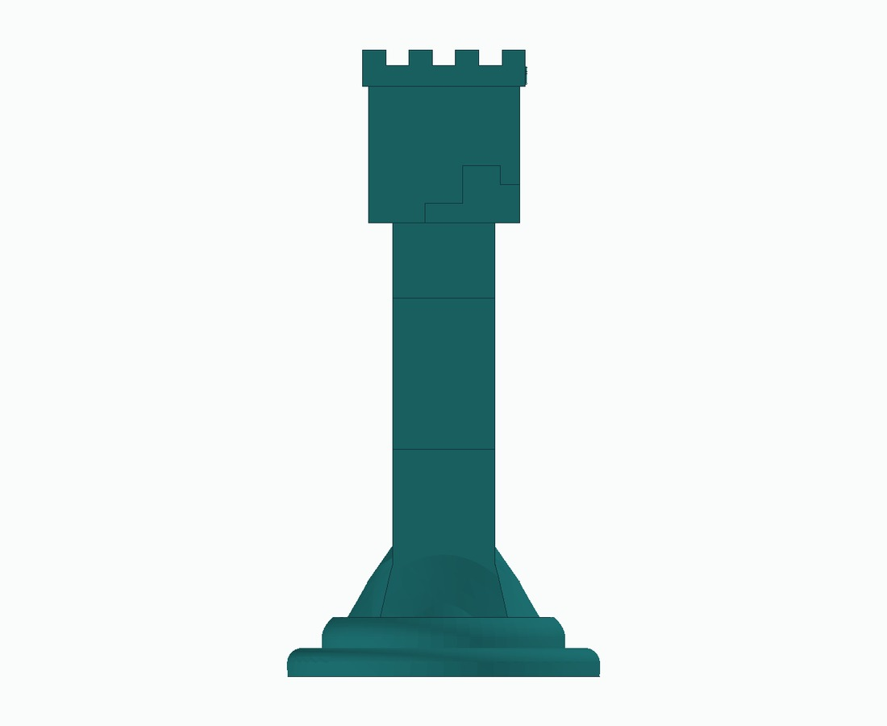
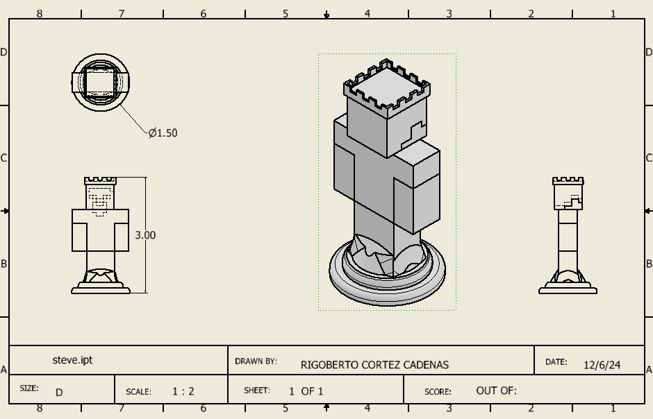
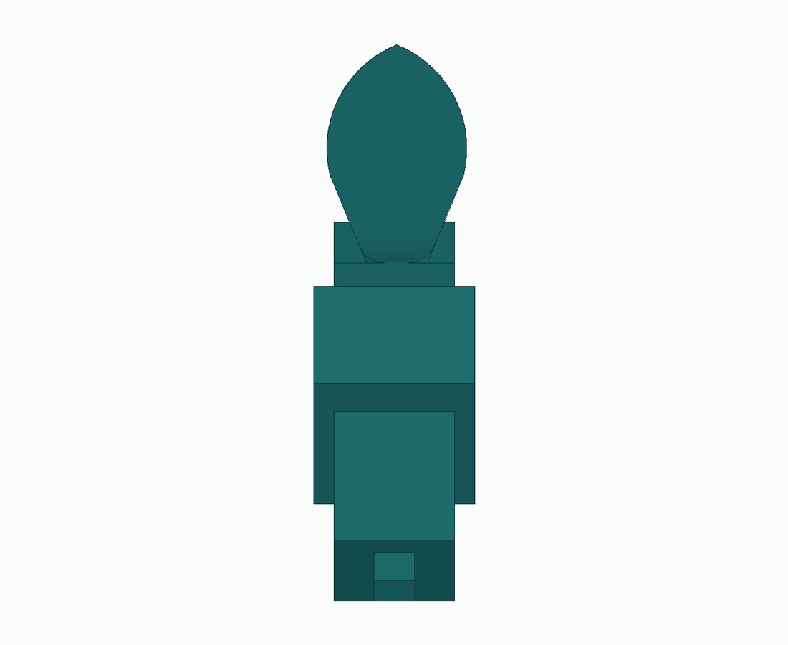
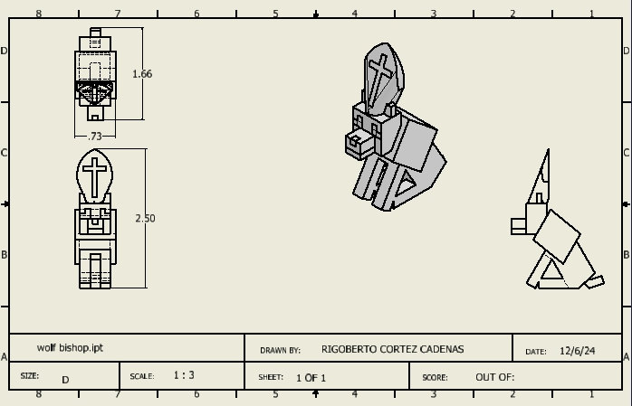

# Minecraft chess set

**PLTW CAD project · November–December 2024 · My parts in a team assembly**

I designed the **knight, Steve piece, and wolf bishop**. Their drawing title blocks credit Rigoberto Cortez Cadenas. The shared set brought those pieces together with my teammates’ designs.

## My three designs

Knight | Steve piece | Wolf bishop
--- | --- | ---
 |  | 

The model views below render the supplied STEP geometry. The display color is for presentation. The original drawings remain the dimensional reference.

## Knight

A block-style horse head mounted on a chess-piece base. The engineering drawing preserves the design’s dimensions and identifies my contribution.

### Model views

End view | Side view
--- | ---
 | 

[Knight STEP](../assets/cad/chess-knight.step) · [Knight STL](../assets/stl/chess-knight.stl)

## Steve piece

A Minecraft-inspired character with a shaped chess base and a crown-like top. The drawing and STEP model show the body geometry and views used to document the part.

### Model views

End view | Side view
--- | ---
 | 

[Steve STEP](../assets/cad/chess-steve.step) · [Steve STL](../assets/stl/chess-steve.stl)

## Wolf bishop

A seated wolf-inspired form with a bishop element at the top. The side view makes the profile, tail, and upper feature easier to read.

### Model views

End view | Side view
--- | ---
 | 

[Wolf bishop STEP](../assets/cad/chess-wolf-bishop.step) · [Wolf bishop STL](../assets/stl/chess-wolf-bishop.stl)

## Team assembly

The assembly is shared team work. Other drawing title blocks credit **Natalie Munoz, Stephanie Garcia Solis, and Emiliano Banuelos**. I claim the three pieces credited to me rather than authorship of the complete set.

The archives contain CAD models, dimensioned drawings, and STL exports. They do not establish that the full set was physically printed.

## Design process and next iteration

The project practiced part modeling, engineering drawings, and assembly coordination. I would next check base consistency and small features across the set, then record the fit and stability of physical test prints.

Select any image to open it at full size. The STL links also provide a format that compatible mesh viewers can display.

[Back to portfolio](../README.md)
