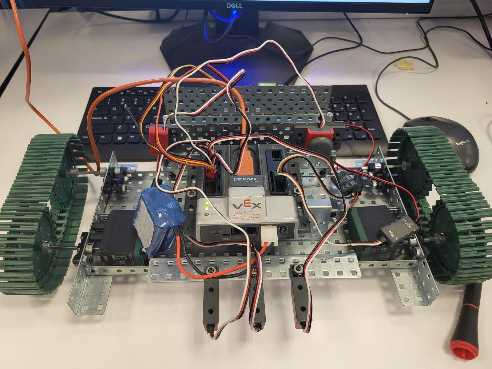
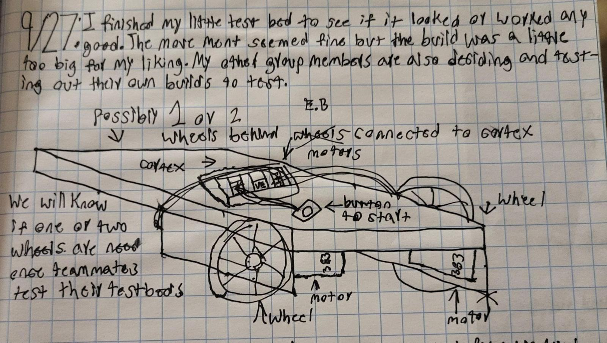
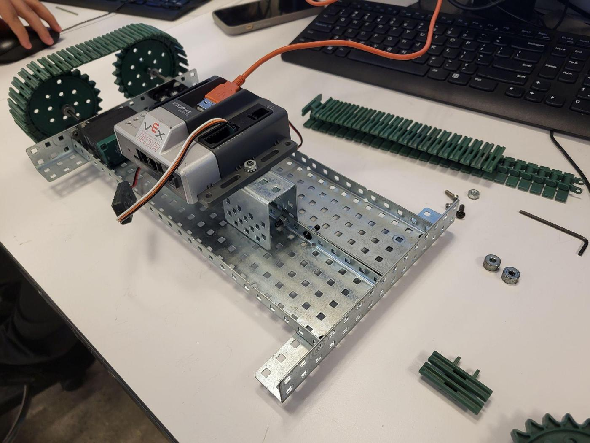
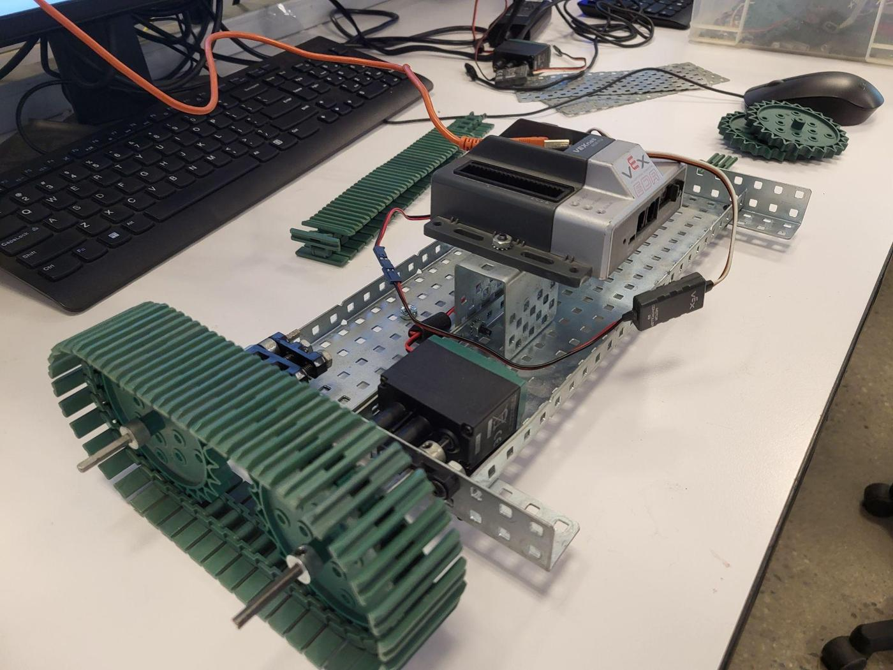
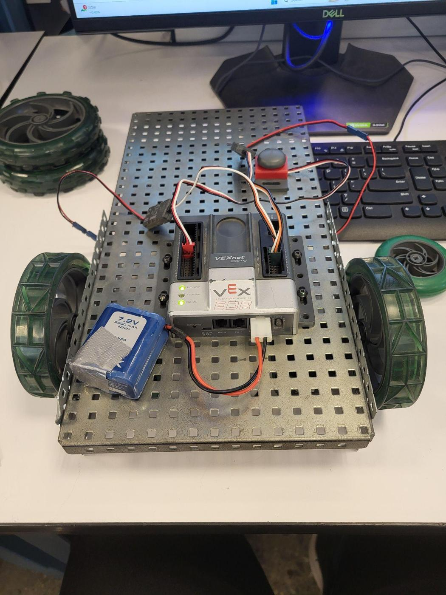
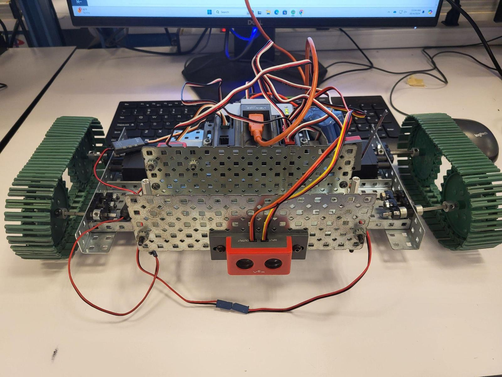
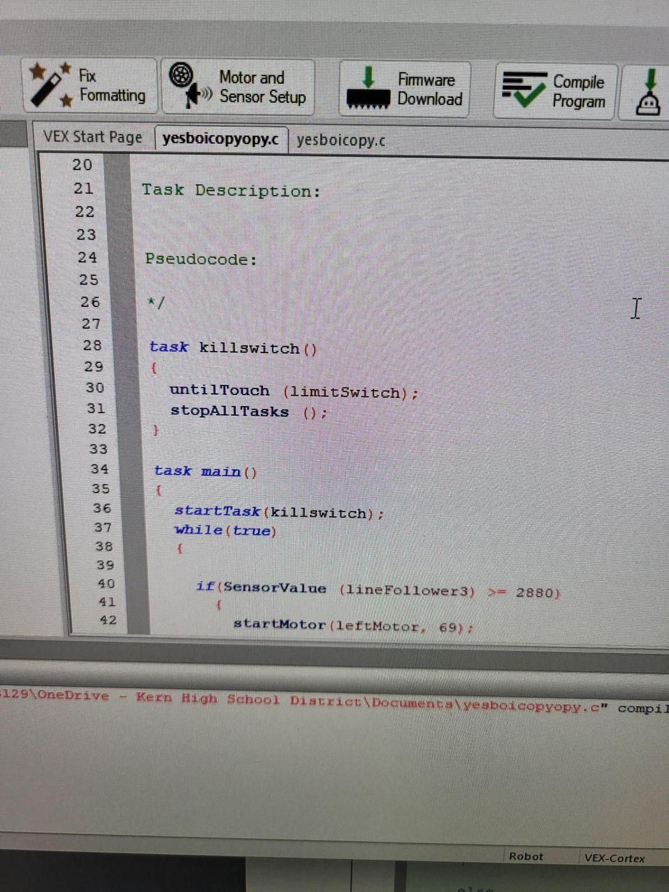
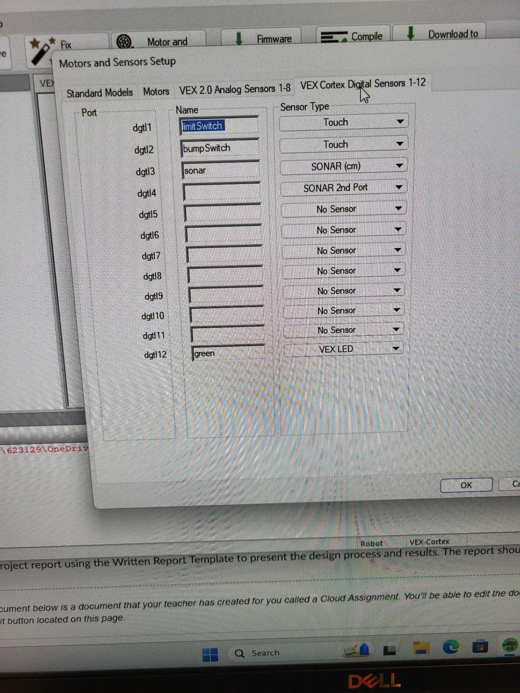
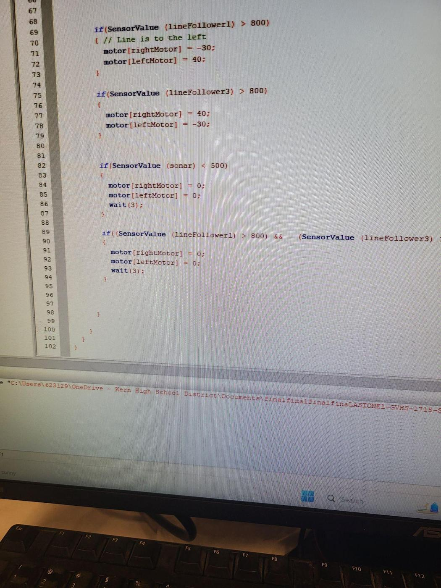

# Tracked line-following robot

**PLTW Computer Integrated Manufacturing · September–October 2024 · Team prototype**

## Goal

Build an automated guided vehicle that carries cargo along a marked route. The assignment required a manual start, a ¼-inch black line, an intersection stop lasting six seconds, an emergency stop, and obstacle detection.

## Hardware and integration

The robot used a VEX Cortex, two 393 motors, motor controllers, tank tracks, and a geared drivetrain. Three infrared line trackers provided route sensing. An ultrasonic range finder faced forward, with bump and limit switches available for start and stop functions.

The mechanical layout needed to leave room for sensors, cargo, the battery, and wiring while keeping the drivetrain aligned. The photographs document the build as it developed from a chassis into an integrated prototype.

## Control work

The report includes RobotC screenshots and sensor configuration. The intended behavior combined line following, intersection handling, and stopping for an obstruction. The assignment’s required behavior should be read separately from the final implementation status.

## Outcome

The team built the physical vehicle and integrated its components. The report describes the mechanical design positively, but explicitly says the code needed more work and was not finished. It contains no reproducible route-completion or tracking-accuracy measurement.

## My contribution and team

I contributed to the team build and its engineering documentation. The source report lists **Nayeli Leyva, Rigoberto Cortez, and Emiliano Banuelos**. It does not break down individual responsibility for each subsystem.

## What I would improve

Start software testing while the chassis is still simple. Verify each sensor independently, then test line following before adding the intersection and obstacle behaviors. Reserve time to log failures and tune the integrated system.

**Source:** `Engineering_WrittenReport_Template.docx`, titled “Automated Guided Vehicle Project Tank Edition.”

## Visual gallery

### Build progression

Chassis and drivetrain | Assembly stage | Side view
--- | --- | ---
 |  | 

### Integrated hardware

Sensor-facing view | Initial concept sketch
--- | ---
 | 

### Programming evidence

RobotC code screenshot | Sensor configuration screenshot
--- | ---
 | 

Select any image to open it at full size.

[Back to portfolio](../README.md)
